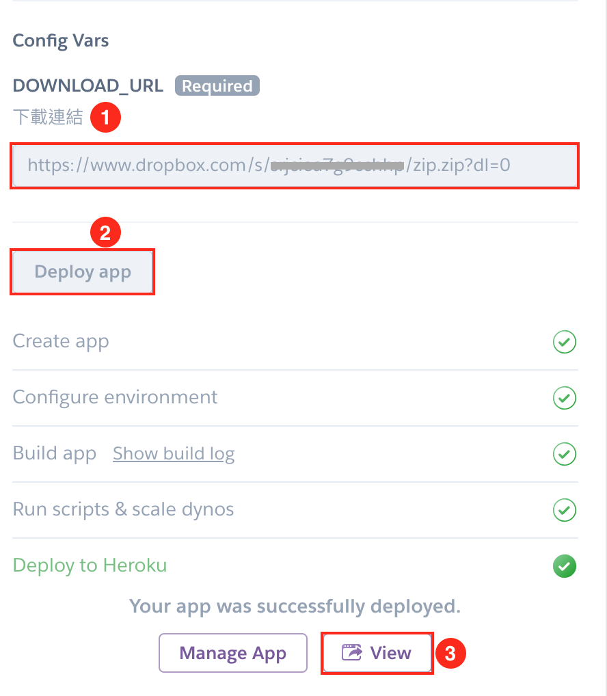

[](https://heroku.com/deploy)

# Table of contents

* [TL;DR](#tldr)
* [TL;DR with Docker](#tldr-with-docker)
* [TL;DR with Heroku Deploy](#tldr-with-heroku-deploy)
* [About](#about)
    * [Demo](#demo)
* [Prerequisite](#prerequisite)
* [Usage](#usage)
    * [Start](#start)
    * [Images](#images)
        * [Compress and Blur Images](#compress-and-blur-images)
    * [Configuration](#configuration)
    * [Database](#database)
    * [Optimize](#optimize)
* [How to develop](#how-to-develop)
* [Test](#test)

# TL;DR

1. `git clone https://github.com/ueewbdy93/wedding-screen.git && cd wedding-screen`
2. Build: `cp src/config/config.sample.json src/config/config.json && npm install && npm run build`
3. Start server: `npm run start`
4. Now you can browse the service with your favorite browser at http://localhost:5566 as user and, http://localhost:5566/admin-index.html (password: happy) as admin.

# TL;DR with Docker

1. `docker pull dy93/wedding-screen:latest`
2. Prepare 3 folders:
  - `images`: put your images into it
  - `config`: put `config.json` into it. See [Configuration](#configuration) for detailed information.
  - `db`: empty folder which the db files will created in
3. `docker run -d -p 5566:5566 -v /PATH/TO/config:/usr/src/app/dist/config -v /PATH/TO/db:/usr/src/app/db -v /PATH/TO/images/:/usr/src/app/src/public/images dy93/wedding-screen`
4. Now you can browse the service with your favorite browser at http://localhost:5566 as user and, http://localhost:5566/admin-index.html as admin.

# TL;DR with Heroku Deploy

1. Packing your images and config.json into a folder and zip it.
    - folder structure:
      ```
      .
      ├── config.json  # config must be named config.json
      ├── normal           # folder to put normal images
      |   ├── image1.jpg   # normal image
      |   └── ...
      └── blur             # folder to put blur images
          ├── image1.jpg   # blurred image of normal/image1.jpg
          └── ...
      ```
    - See [Configuration](#configuration) for more information about `config.json`.
    - See [Images](#images) for more information about images.
2. Upload the zipped folder to a cloud storage services(ex: dropbox) and generate a share link.
3. Click [](https://heroku.com/deploy)
    - You must create a Heroku account first.
    - Fill `DOWNLOAD_URL` field with the shared link that created in step 2.
    - Click `Deploy app` button. Then Heroku will automatically download configuration and images from the shared link and run deployment process.
    - After finishing deployment, click `View` button to visit your own wedding web-app!
    - 

**NOTE**: from [Heroku document](https://devcenter.heroku.com/articles/dynos#restarting)
> Dynos are also restarted (cycled) at least once per day to help maintain the health of applications running on Heroku. Any changes to the local filesystem will be deleted.

Since the sqlite file is stored in local filesystem, all data will be cleared when Dynos restarting.
You can download the sqlite file in admin page to preserve data.

# About

A wedding activity web app implemented by a happy programmer couple [dy93](https://github.com/dy93) and [ueewbd](https://github.com/ueewbd) ❤️.

There are two modes and an admin page

1. _slideshow_ mode:

    Users can see wedding pictures and leave bullet comments.
2. _game_ mode:

    This mode was inspired by [Kahoot!](https://kahoot.com/welcomeback/). Since Kahoot does not show full description of options on users' phone and it's a requirement for us. We decided to implement this game service by ourselves.
3. _admin_ page:

    Admin can switch between modes and control the game state.
    Download sqlite file.

## Demo

- https://wedding-screen.herokuapp.com/
- Admin (password: happy): https://wedding-screen.herokuapp.com/admin-index.html

# Prerequisite

- Nodejs 10

# Usage

## Start

1. Clone the project from github.

    ```
    git clone https://github.com/ueewbdy93/wedding-screen.git
    ```

2. cd into project folder.

    ```
    cd wedding-screen
    ```

3. Install dependency.

    ```
    npm install
    ```

4. Set up configurations.

    ```
    cp src/config/config.sample.json src/config/config.json
    ```

5. Compile **typescript** to **javascript**.

    ```
    npm run build
    ```

6. Start server.

    ```
    npm run start
    ```

OK! Now you can visit http://localhost:5566 to watch slideshow or play game.

Visit http://localhost:5566/admin-index.html and login(default password:happy) to control the state.

## Images

Each slide contains two images. One is the original image, the other is the blurred one.
The original one will be place in the center of the screen and scaled to match the screen height or width according to whether it's on mobile device or not.
The blurred one is used as background to fill the blank that original image doesn't cover.

See our [demo site](http://wedding-screen.herokuapp.com/) for example.

Basically, the original images should be put under `src/public/images/normal/`.
Put the blurred images under `src/public/images/blur/`.

Also, the blur image's name should be the same with its respect normal image's.

### Compress and Blur Images

We use [GraphicsMagick Utilities](http://www.graphicsmagick.org/utilities.html) to do that.
Here is the example script:

```shell
src=PATH/TO/INPUT/IMAGES
for i in `ls $src`; do
  gm convert -size 1280x1280 $src/$i -resize 1280x1280 images/normal/$i
  gm convert images/normal/$i -blur 0x4 images/blur/$i
done
```

## Configuration

Edit *src/config/config.json*
(If not exists, copy from *src/config/config.sample.json*)

Configuration options:

| property  | description  |
|---|---|
| admin.password | Admin login password |
| slide.intervalMs | Slideshow interval |
| game.intervalMs | Answer time |
| game.questions | List of question objects |
| game.questions[].text | Question text |
| game.questions[].options | List of option objects. Each question **must** have 4 options |
| game.questions[].options[].text | Option text |
| game.questions[].options[].isAnswer | (boolean) Indicate whether this option is correct. Allow multiple answers |

See [config.sample.json](src/config/config.sample.json) for example.

## Database

Use sqlite.
DB file name is in the format of `db/db-<timestamp>.sqlite` which is created on server starting.
To view the data, download the file and open it with any sqlite viewer.

## Optimize

If you encounter performance issues. The tips below could help.

- Compress images to a reasonable size. There are lots of tools can do that (ex: https://tinypng.com/).
- Use the production build for front-end. See [React document](https://reactjs.org/docs/optimizing-performance.html#use-the-production-build) for more detailed information.
- It's recommend to use 4G since the WiFi offered by the wedding venue may be slow.

# How to develop
1. Compile typescript in watch mode: `npm run dev`
2. Modify the code under *src*
3. Every time you modify the code, the server will auto hot-reload :)

# Test
To be completed
