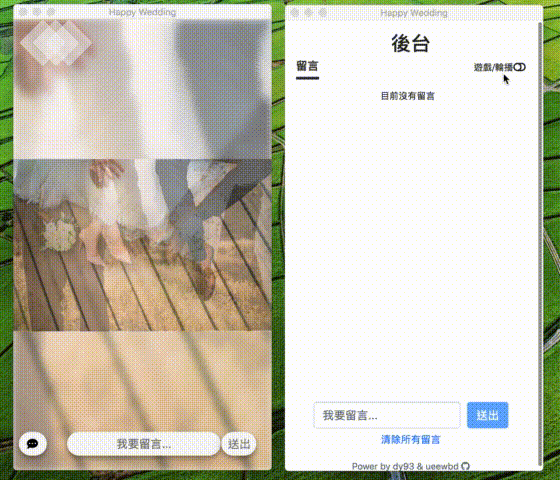

[](https://heroku.com/deploy)

# Table of contents

- [TL;DR](#tldr)
- [TL;DR with Docker](#tldr-with-docker)
- [TL;DR with Heroku Deploy](#tldr-with-heroku-deploy)
- [About](#about)
  - [Demo](#demo)
- [Prerequisite](#prerequisite)
- [Usage](#usage)
  - [Start](#start)
  - [Configuration](#configuration)
  - [Database](#database)
  - [Optimize](#optimize)
- [How To Develop](#how-to-develop)
- [Test](#test)

# TL;DR

1. `git clone https://github.com/ueewbdy93/wedding-screen.git && cd wedding-screen`
2. Build: `cp src/config/config.sample.json src/config/config.json && npm install && npm run build`
3. Start server: `npm run start`
4. Now you can browse the service with your favorite browser at http://localhost:5566 as user and, http://localhost:5566/admin-index.html (password: happy) as admin.

# TL;DR with Docker

1. `docker pull dy93/wedding-screen:latest`
2. Prepare 3 folders:
  - `images`: put your images into it
  - `config`: put `config.json` into it. See [Configuration](#configuration) for detailed information.
  - `db`: empty folder which the db files will created in
3. `docker run -d -p 5566:5566 -v /PATH/TO/config:/usr/src/app/dist/config -v /PATH/TO/db:/usr/src/app/db -v /PATH/TO/images/:/usr/src/app/dist/public/images dy93/wedding-screen`
4. Now you can browse the service with your favorite browser at http://localhost:5566 as user and, http://localhost:5566/admin-index.html as admin.

# TL;DR with Heroku Deploy
 
1. Packing your images and config.json into a folder and zip it.
2. Upload it to a cloud storage services(ex: google drive, dropbox) and generate a share link.
3. Click [](https://heroku.com/deploy)

# About

A wedding activity web app implemented by a happy programmer couple [dy93](https://github.com/dy93) and [ueewbd](https://github.com/ueewbd) ❤️.

There are two modes and an admin page

1. _slideshow_ mode:

    Users can see wedding pictures and leave bullet comments.
2. _game_ mode:

    This mode was inspired by [Kahoot!](https://kahoot.com/welcomeback/). Since Kahoot does not show full description of options on users' phone and it's a requirement for us. We decided to implement this game service by ourselves.
3. _admin_ page:

    Admin can switch between modes and control the game state.

## Demo

- https://wedding-screen.herokuapp.com/
- Admin (password: happy): https://wedding-screen.herokuapp.com/admin-index.html

# Prerequisite

- Nodejs 10

# Usage

## Start

1. Clone the project from github.

    ```
    git clone https://github.com/ueewbdy93/wedding-screen.git
    ```

2. cd into project folder.

    ```
    cd wedding-screen
    ```

3. Install dependency.

    ```
    npm install
    ```

4. Set up configurations.

    ```
    cp src/config/config.sample.json src/config/config.json
    ```

5. Compile **typescript** to **javascript**.

    ```
    npm run build
    ```

6. Start server.

    ```
    npm run start
    ```

OK! Now you can visit http://localhost:5566 to watch slideshow or play game.

Visit http://localhost:5566/admin-index.html and login(default password:happy) to control the state.

## Configuration

Put your images into `src/public/images/`

Edit *src/config/config.json*
(If not exists, copy from *src/config/config.sample.json*)

Configuration options:

| property  | description  |
|---|---|
| admin.password | Admin login password |
| slide.intervalMs | Slideshow interval |
| game.intervalMs | Answer time |
| game.questions | List of question objects |
| game.questions[].text | Question text |
| game.questions[].options | List of option objects. Each question **must** have 4 options |
| game.questions[].options[].text | Option text |
| game.questions[].options[].isAnswer | (boolean) Indicate whether this option is correct. Allow multiple answers |

Following is the example of `config.json`:

```json
{
  "admin": {
    "password": "happy"
  },
  "slide": {
    "intervalMs": 3000
  },
  "game": {
    "intervalMs": 8000,
    "questions": [
      {
        "text": "Q1. Something is small, red, round and sweet?",
        "options": [
          { "text": "Orange", "isAnswer": false },
          { "text": "Apple", "isAnswer": true },
          { "text": "Lemon", "isAnswer": false },
          { "text": "Grape", "isAnswer": false }
        ]
      },
      {
        "text": "Q2. Something starts with an H and ends with an oof?",
        "options": [
          { "text": "Bokoblin", "isAnswer": false },
          { "text": "Moblin", "isAnswer": false },
          { "text": "Lynel Hoof", "isAnswer": true },
          { "text": "Lynel Hoof", "isAnswer": true }
        ]
      }
    ]
  }
}
```

## Database

Use sqlite.
DB file name is in the format of `db/db-<timestamp>.sqlite` which is created on server starting.
To view the data, download the file and open it with any sqlite viewer.

## Optimize

If you encounter performance issues. The tips below could help.

- Compress images to a reasonable size. There are lots of tools can do that (ex: https://tinypng.com/).
- Use the production build for front-end. See [React document](https://reactjs.org/docs/optimizing-performance.html#use-the-production-build) for more detailed information.
- It's recommend to use 4G since the WiFi offered by the wedding venue may be slow.

# How to develop
1. Compile typescript in watch mode: `npm run dev`
2. Modify the code under *src*
3. Every time you modify the code, the server will auto hot-reload :)

# Test
To be completed

# Useful script

- Compress image
```shell
for i in `ls image`; do
  gm convert -size 1280x1280 /PATH/TO/IMAGE/FOLDER/$i -resize 1280x1280 /DIST/FOLDER/$i
done
```